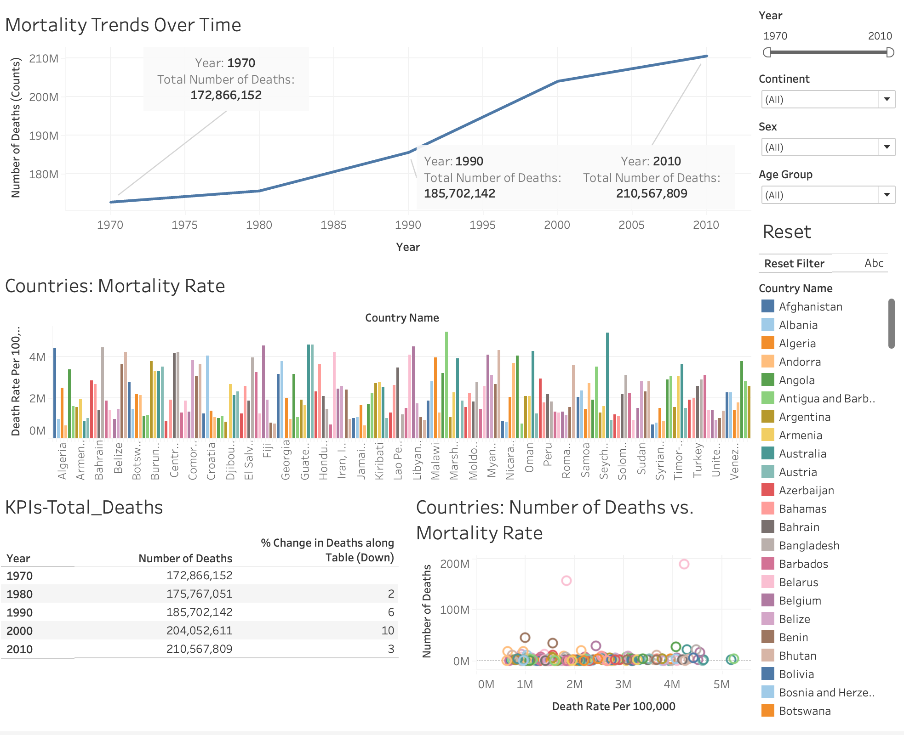

# Global Mortality, 1970-2010

Interactive Tableau dashboards on age- and sex-specific mortality in 187 countries,
built on the Global Burden of Disease Study 2010 (GBD 2010) estimates from the
Institute for Health Metrics and Evaluation (IHME).

[View on Tableau Public](https://public.tableau.com/app/profile/satvik.praveen4534/viz/Global_Mortality_Dashboard/Time-Series-Dashboard)
· [Analytical audit](../docs/analytical_audit.md)
· [Workbook inventory](../docs/workbook_inventory.md)

> [!IMPORTANT]
> With the default filter settings, the published death counts are four times
> the true values, and some charts add rates together. The correct figures and
> the fixes are listed under [Known limitations](#known-limitations).

## Questions

1. How did the number of deaths change between 1970 and 2010, globally and by continent?
2. How do crude death rates differ across countries, and how do they vary by age group and sex?
3. Which countries combine high death rates with large numbers of deaths?

## Data

| | |
|---|---|
| **Dataset** | GBD 2010 Mortality Results 1970-2010 ([GHDx record](https://ghdx.healthdata.org/record/ihme-data/gbd-2010-mortality-results-1970-2010)) |
| **File** | `Dataset/IHME_GBD_2010_MORTALITY_AGE_SPECIFIC_BY_COUNTRY_1970_2010.csv` |
| **Coverage** | 187 countries × 5 years (1970, 1980, 1990, 2000, 2010) × 21 age groups × 3 sex categories = 58,905 rows |
| **Method paper** | Wang H, *et al.* *The Lancet* 2012; 380: 2071-94. doi:[10.1016/S0140-6736(12)61719-X](https://doi.org/10.1016/S0140-6736(12)61719-X) |
| **License** | IHME Free-of-Charge Non-Commercial User Agreement (see [DATA_LICENSE.md](../DATA_LICENSE.md)) |

### Data dictionary

| Column | Type | Notes |
|---|---|---|
| `Country Code` | string | ISO 3166-1 alpha-3. Prefer this to names for joins. |
| `Country Name` | string | GBD 2010 names. Some predate current usage, for example `Swaziland`. |
| `Year` | integer | Decennial snapshots only. There are no intermediate years. |
| `Age Group` | string | 20 age bands from `0-6 days` to `80+ years`, plus the aggregate **`All ages`**. |
| `Sex` | string | `Male`, `Female`, plus the aggregate **`Both`**. |
| `Number of Deaths` | number | Rounded to whole deaths and stored with thousands separators. |
| `Death Rate Per 100,000` | number | Crude, annualised rate. Neonatal bands can exceed 100,000 because a 7-day interval is annualised. |

**Aggregates are stored as rows.** `Both` equals `Male` + `Female` (within 1 death),
and `All ages` equals the sum of the 20 age bands (within 6 deaths). Any `SUM`
over unfiltered rows therefore counts each death four times. The verification
script `python -m tools.verify_data` checks both identities.

## Workbooks

| File | Contents |
|---|---|
| `Global_Mortality_Analysis.twb` | Main workbook with both dashboards and all seven worksheets |
| `Global-Mortality-Rate-Dashboard.twb` | Standalone export of the *Global Mortality Overview* dashboard |
| `Time-Series-Dashboard.twb` | Standalone export of the *Mortality Trends Over Time* dashboard |

All three share the same calculated fields. See the
[workbook inventory](../docs/workbook_inventory.md) for the full formulas.

## Dashboards

### Global Mortality Overview


A choropleth of the median death rate per country with filters for year, age group,
sex and continent. KPI tiles report a *global median death rate* and *total deaths*
for the current selection.

### Mortality Trends Over Time



- **Line chart.** Number of deaths by year.
- **Bar chart.** Death rate by country.
- **KPI table.** Deaths by year with the percentage change from the previous snapshot.
- **Scatter plot.** Number of deaths against death rate per country.

### Calculated fields

| Field | Definition | Purpose |
|---|---|---|
| `Continent` | Hard-coded `IF [Country Name] IN (...)` lists | Continent filter |
| `% Change in Deaths` | `(SUM(deaths) - LOOKUP(SUM(deaths), -1)) / LOOKUP(SUM(deaths), -1) * 100` | Change versus the previous snapshot, which is 10 years earlier |
| `Year Range` | `STR(MIN([Year])) + "-" + STR(MAX([Year]))` | Dynamic titles |

## Known limitations

These findings come from the [analytical audit](../docs/analytical_audit.md). The
audit reproduces each published number from the raw file exactly. The workbooks are
kept as published, so the figures below describe the dashboards as they stand.

| ID | Issue | Effect | Fix |
|---|---|---|---|
| M1 | Sex and Age Group default to *(All)*, which includes the `Both` and `All ages` aggregates | Death counts are 4× too high | Default to `Both` and `All ages`, with no *(All)* option |
| M2 | *Total Deaths* sums all five snapshot years | Not a period total | Show one year |
| M3 | *Global Median Death Rate* pools all ages, sexes and years | No population meaning | Take the median over `Both` / `All ages` for one year |
| M4 | Bar chart and scatter plot use `SUM` of rates | Values in the millions per 100,000 | Use a single cell, or deaths ÷ population |
| M5 | `Swaziland` and `Taiwan` are not in any continent list | Both fall under "Other" | Add them, or map on ISO3 codes |
| M6 | `% Change in Deaths` compares decades | Mislabelled as year-over-year in earlier docs | Relabel. The values are correct. |

Correct global totals for `Sex = Both` and `Age Group = All ages`:

| Year | Deaths shown on the dashboard | Correct deaths |
|---|---:|---:|
| 1970 | 172,866,152 | 43,216,532 |
| 1980 | 175,767,051 | 43,941,750 |
| 1990 | 185,702,142 | 46,425,539 |
| 2000 | 204,052,611 | 51,013,156 |
| 2010 | 210,567,809 | 52,641,951 |

Other caveats:

- Rates are **crude**, not age-standardised. Differences between countries partly reflect age structure.
- Medians across countries are **unweighted**, so a small country counts as much as a large one.
- GBD 2010 estimates have been superseded by later GBD rounds. Treat these values as historical estimates.
- The source file does not include uncertainty intervals, so the dashboards cannot show them.

## Reproduce

1. Open `Global_Mortality_Analysis.twb` in Tableau Desktop 2024.3 or newer.
2. When prompted for the data source, select the CSV in `Dataset/`. The workbook stores the
   author's original absolute path, and its `.hyper` extract is not distributed.
3. Re-derive every number on this page from the repository root:

   ```bash
   python -m tools.verify_data
   python -m tools.audit
   ```

## Citation

Global Burden of Disease Collaborative Network. *Global Burden of Disease Study 2010 (GBD 2010)
Mortality Results 1970-2010.* Seattle, United States of America: Institute for Health Metrics
and Evaluation (IHME), 2012.
