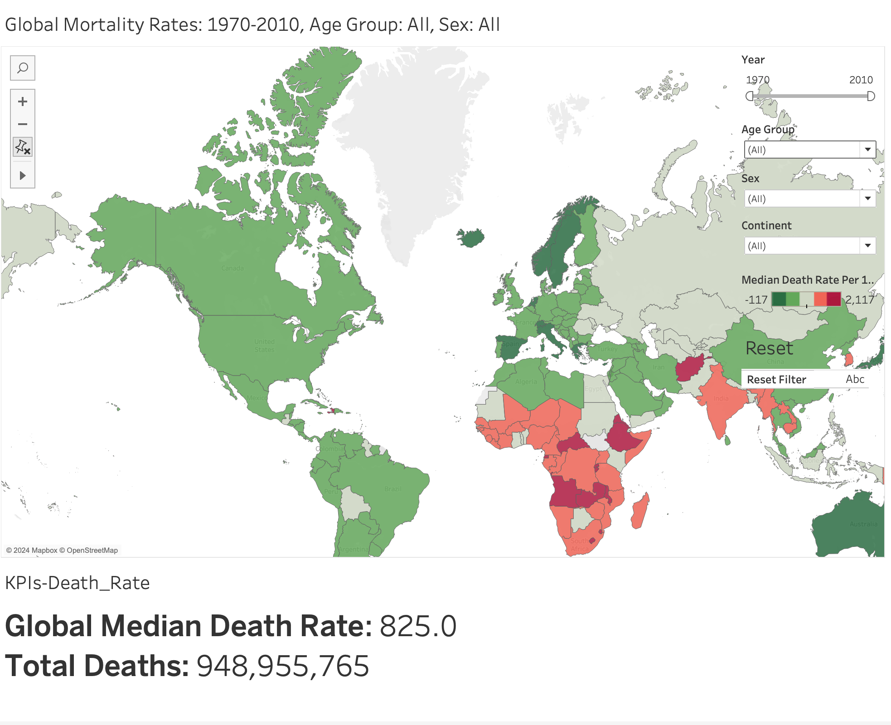
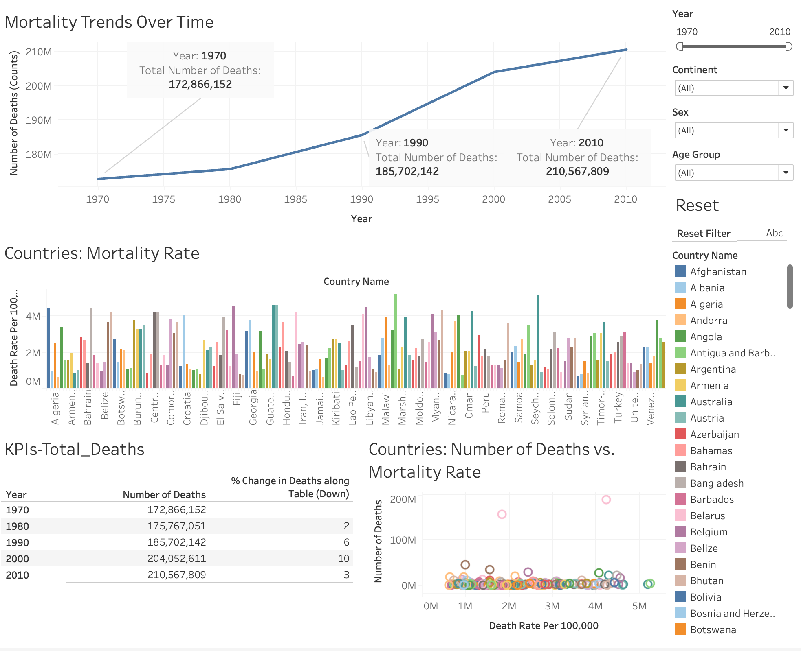

# Global Mortality Analysis Dashboards

## Overview

This repository showcases interactive Tableau dashboards analyzing global mortality trends using age-specific and country-specific data from 1970 to 2010.

## Dashboards

### 1. **Global Mortality Overview**

- **Description**: A map-based visualization showing global mortality rates and deaths, with filters for continent, year, sex, and age group.
- **Key Features**:
  - Interactive map with median death rate and total deaths by country.
  - Filters for dynamic analysis.
  - **Integrated KPI Dashboards**:
    - _KPI - Death Rate_: Highlights global median death rate.

### 2. **Time Series Analysis**

- **Description**: Line charts showing global mortality trends over time.
- **Key Features**:
  - Percentage changes in mortality over decades.
  - Dynamic filtering for country, age group, and sex.
  - **Integrated KPI Dashboards**:
    - _KPI - Total Deaths_: Tracks year-over-year total death counts.

### 3. **Dynamic KPI Dashboards**

- **KPI - Death Rate**:
  - Calculates and visualizes global median death rates.
  - Offers insights into year-over-year changes.
- **KPI - Total Deaths**:
  - Displays total deaths for selected filters.
  - Includes year-over-year percentage changes in deaths.

## Dataset

- **Source**: IHME Global Burden of Disease Study 2010.
- **File**: `IHME_GBD_2010_MORTALITY_AGE_SPECIFIC_BY_COUNTRY_1970_2010.csv`
- **Details**: Contains age-specific and country-specific mortality data from 1970 to 2010.

## How to Explore

1. Open `.twbx` files in Tableau Desktop to explore the dashboards.
2. Use Tableau Public for an online preview: [Link](https://public.tableau.com/app/profile/satvik.praveen4534/viz/Global_Mortality_Dashboard/Time-Series-Dashboard)

## Key Highlights

- Reuse of modular KPI dashboards across visualizations for consistent insights.
- Interactive filters for flexible exploration.
- Clean and concise visualizations to uncover trends in global mortality.
