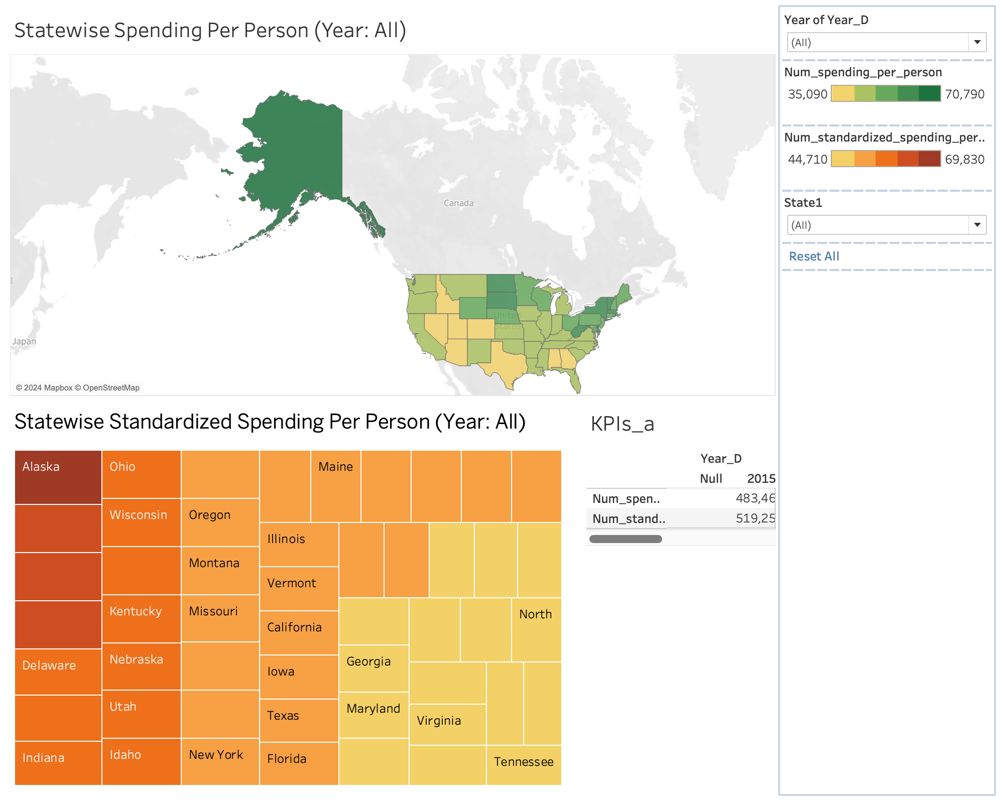
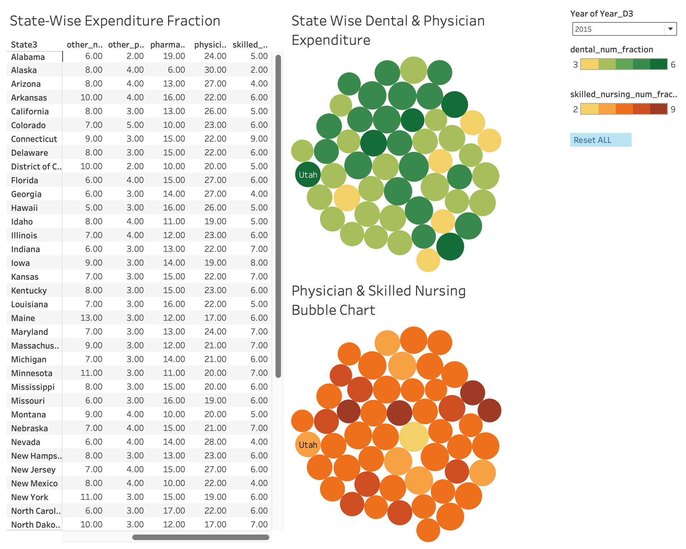

# Cost of Care: US State Health Spending, 2015-2019

Interactive Tableau dashboards on personal health care spending in the 50 US states and
the District of Columbia: spending per person, its split by payer, and its split by
type of care. The data are IHME estimates from the *US Health Expenditure by State,
Payer, and Type of Care* release.

[View on Tableau Public](https://public.tableau.com/app/profile/satvik.praveen4534/viz/Statewise_Healthcare_Spending_Dashboards/Dashboard2_HealthcareFractionalExpenditurebyStateandYear)
· [Analytical audit](../docs/analytical_audit.md)
· [Workbook inventory](../docs/workbook_inventory.md)

> [!IMPORTANT]
> Per-person spending and payer shares are aggregated with `SUM`. They are correct
> when a single year is selected, as in Dashboards 2 and 3. With Year = *(All)*, as in
> Dashboard 1, they add up five annual values. See [Known limitations](#known-limitations).

## Questions

1. How much does health care cost per person in each state, before and after adjusting for age and prices?
2. How is each state's spending split between Medicare, Medicaid, private insurance and out-of-pocket payments?
3. How do states differ in the share spent on hospitals, physicians, dental care and skilled nursing?

## Data

| | |
|---|---|
| **Dataset** | United States Health Expenditure by State, Payer, and Type of Care, 2003-2019 ([GHDx record](https://ghdx.healthdata.org/record/ihme-data/united-states-health-spending-by-state-payer-type-service-2003-2019)) |
| **File** | `Dataset/IHME_USA_STATE_HEALTH_SPENDING_2003_2019_DATA_TABLES_Y2022M08D23.XLSX` |
| **Coverage of this file** | 51 states (50 + DC) × **2015-2019**. The release spans 2003-2019, but these data tables contain only 2015-2019. |
| **Units** | USD. The growth-rate footnotes state 2020 USD. |
| **License** | IHME Free-of-Charge Non-Commercial User Agreement (see [DATA_LICENSE.md](../DATA_LICENSE.md)) |

Every value is published as `point (lower - upper)`, a point estimate with its
uncertainty interval, for example `$8170 ($8020 - $8320)`.

### Data dictionary

| Sheet | Rows | Columns | Content |
|---|---:|---|---|
| `Table e9a` | 255 | State, Year, Total Spending, Spending per Person, Standardized Spending per Person | Total spending in billions of USD. Per-person spending, raw and standardized. |
| `Table e9b` | 255 | State, Year, Fraction Medicare / Medicaid / Private / OOP | Share of spending by payer, in whole percent |
| `Table e9c` | 255 | State, Year, Fraction Hospital / Physician/clinical services / Skilled nursing / Home health / Pharmaceuticals / Dental / Other professional / Other | Share of spending by type of care, in whole percent |
| `Table e9d` | 51 | State, Aggregate, Medicaid, Medicare, OOP, Private | Growth rates in spending per person, *before* controlling for age, price and other factors |
| `Table e9e` | 51 | State, Aggregate, Medicaid, Medicare, OOP, Private | Growth rates, *after* controlling for age, price and other factors |

"Standardized" spending is adjusted for differences in age structure and prices
between states, per the table footnotes. Shares are rounded to whole percents, so
a state's shares sum to 98-102% rather than exactly 100%.

## Workbooks

| File | Contents |
|---|---|
| `Statewise_Healthcare_Spending_Analysis.twb` | Main workbook with all three dashboards and twelve worksheets |
| `Statewise_Spending_Insights_Per_Person_and_Standardized_Metrics_Dashboard1.twb` | Standalone export of Dashboard 1 |
| `Healthcare_Fractional_Expenditure_by_State_and_Year_Dashboard2.twb` | Standalone export of Dashboard 2 |
| `Statewise_Healthcare_Expenditure_Dental_Physician_and_Skilled_Nursing_Focus_Dashboard3.twb` | Standalone export of Dashboard 3 |

The text cells are turned into numbers with calculated fields. Examples are
`Num_spending_per_person`, defined as `INT(REPLACE(SPLIT([F4], " ", 1), "$", ""))`, and
`medicare_fraction_num`, defined as `INT(LEFT(..., FIND(..., "%") - 1))`. These keep the
point estimate and drop the interval. All formulas are listed in the
[workbook inventory](../docs/workbook_inventory.md).

## Dashboards

### 1. Spending per person and standardized spending



A choropleth of spending per person and a treemap of standardized spending per person,
with year and state filters and a KPI table.

### 2. Spending by payer


A table of the Medicare, Medicaid, private and out-of-pocket shares for every state, a
map of the Medicare share, and KPI tiles for the selected state.

### 3. Spending by type of care



A table of service-type shares and two packed-bubble charts. One shows dental and
physician shares and the other shows physician and skilled nursing shares.

## Known limitations

These findings come from the [analytical audit](../docs/analytical_audit.md), which
reproduces each published number from the raw file. The workbooks are kept as
published.

| ID | Issue | Effect | Fix |
|---|---|---|---|
| S1 | Dashboard 1 sums per-person spending over years when Year = *(All)* | Legend reads 35,090-70,790 USD instead of a single-year range of 6,720-14,500 USD | Use `AVG`, or require one year |
| S2 | `KPIs_a` sums per-person values across states | 483,460 USD for 2015 has no meaning | Population-weighted mean: 9,160 USD per person in 2015 |
| S3 | Documentation described the data as 2003-2019 | The file covers 2015-2019 only | Corrected here |
| S4 | Uncertainty intervals are dropped | Most payer-level growth-rate intervals include zero | Show intervals; do not rank states on them |
| S5 | Shares are whole percents | Differences of 1-2 points are within rounding | Interpret accordingly |
| S6 | Growth-rate fields (e9d/e9e) are defined but unused | None | Remove them, or add a view with intervals |
| S7 | Shares use `SUM` | Correct for one year, as published. About 5× too high under *(All)*. | Use `AVG` |

Population-weighted national spending per person can be recovered from the file
itself, because population equals total spending divided by spending per person:

| Year | USD per person, population-weighted | Unweighted mean of states |
|---|---:|---:|
| 2015 | 9,160 | 9,480 |
| 2016 | 9,439 | 9,767 |
| 2017 | 9,592 | 9,910 |
| 2018 | 9,705 | 10,006 |
| 2019 | 9,939 | 10,235 |

Other caveats:

- Per the IHME GHDx record description, values after 2014 are IHME estimates. The CMS
  State Health Expenditure Accounts, which IHME builds on, end in 2014. This was not
  independently re-checked.
- The growth-rate tables do not state their reference period. Check the IHME codebook
  before interpreting them.

## Reproduce

1. Open `Statewise_Healthcare_Spending_Analysis.twb` in Tableau Desktop 2024.3 or newer.
2. When prompted, point the Excel connection at the file in `Dataset/`. The workbook stores
   the author's absolute path, and its `.hyper` extract is not distributed.
3. Re-derive every number on this page from the repository root:

   ```bash
   python -m tools.verify_data
   python -m tools.audit
   ```

## Citation

Institute for Health Metrics and Evaluation (IHME). *United States Health Expenditure by
State, Payer, and Type of Care, 2003-2019.* Seattle, United States of America: IHME, 2022.
