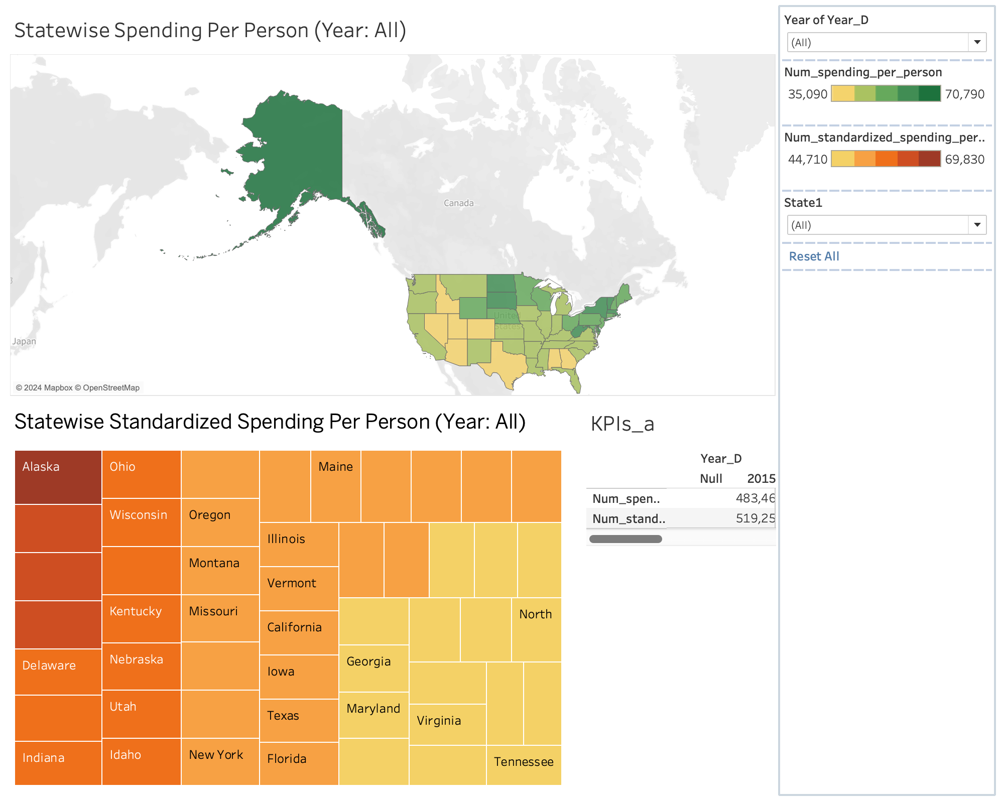
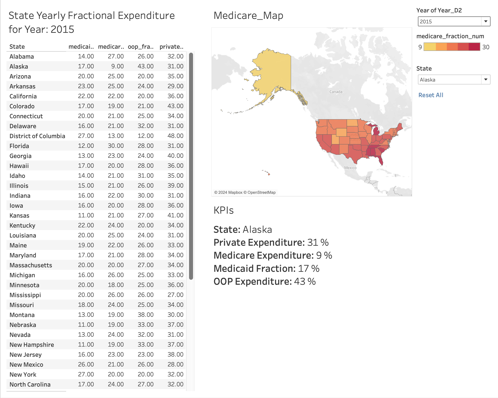
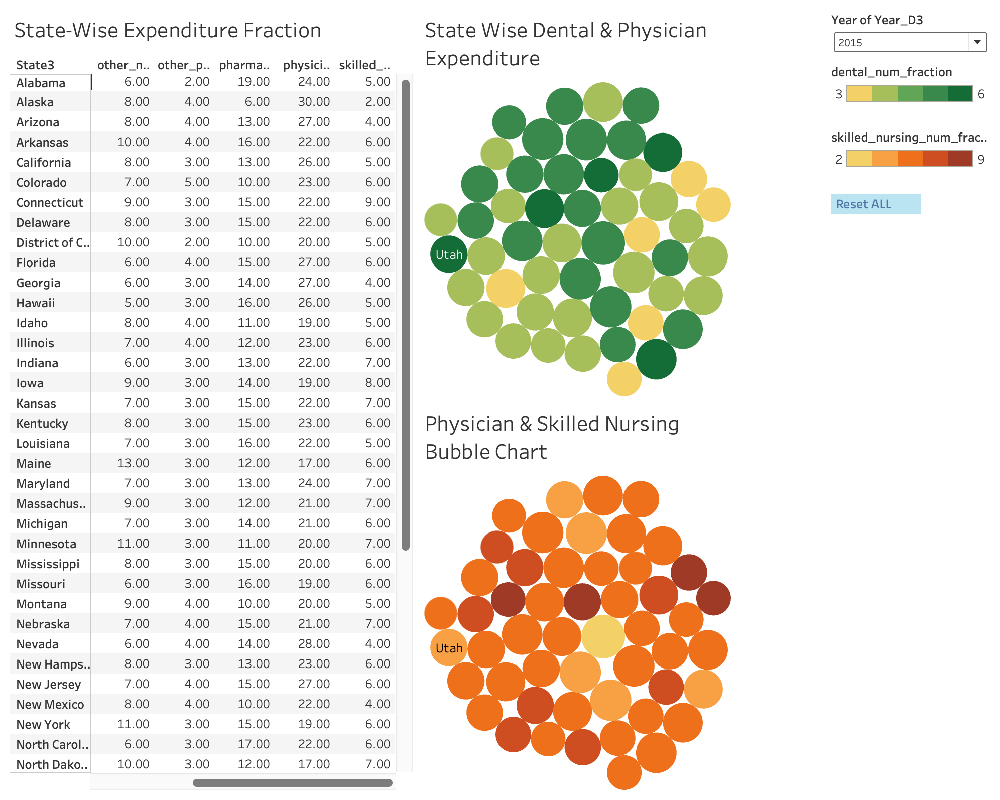

# Statewise Healthcare Spending Analysis

## Overview

This project focuses on analyzing state-level healthcare expenditure data across various categories such as Medicare, Medicaid, private expenditure, and skilled nursing. The dashboards provide visual insights into spending trends, fractional expenditures, and category-specific distributions across states in the United States.

---

## Tableau Workbook

- **File Name**: `Statewise_Healthcare_Spending_Dashboards.twbx`
- **Description**: This Tableau workbook consolidates all three dashboards, allowing users to navigate between them seamlessly. Each dashboard focuses on a specific aspect of statewise healthcare expenditure analysis.
- **View Online**: The workbook is available on [Tableau Public](https://public.tableau.com/app/profile/satvik.praveen4534/viz/Statewise_Healthcare_Spending_Dashboards/Dashboard2_HealthcareFractionalExpenditurebyStateandYear?publish=yes).

---

## Dashboards

### 1. **Statewise Spending and Standardized Spending Per Person**

- **Description**:
  - Visualizes statewise healthcare spending and standardized spending per person.
  - Allows comparisons across states and identification of spending trends.
- **Key Features**:
  - A map visualization highlighting spending per person across states.
  - A treemap showcasing standardized spending.
  - Interactive filters for year and state-level insights.
- **Use Case**: Quickly identify states with the highest and lowest spending per person.

---

### 2. **Statewise Fractional Expenditure Breakdown**

- **Description**:
  - Displays yearly fractional healthcare expenditure broken down into categories such as Medicare, Medicaid, and private expenditure.
  - Visualizes spending in the form of a heatmap and a KPI section for detailed state-level analysis.
- **Key Features**:
  - Detailed table for fractional spending across all states.
  - Map visualizing Medicare fractional expenditure.
  - KPI cards summarizing key metrics such as private and Medicaid expenditure for selected states.
- **Use Case**: Compare category-wise spending across states and observe trends over the years.

---

### 3. **Category-Specific Expenditure Analysis**

- **Description**:
  - Provides an in-depth look at expenditures on dental care, skilled nursing, physicians, and other healthcare categories.
  - Utilizes bubble charts to visually represent expenditure distributions.
- **Key Features**:
  - Bubble chart for dental and physician expenditure.
  - Bubble chart for skilled nursing and other healthcare categories.
  - Interactive filters for year-based and category-specific exploration.
- **Use Case**: Highlight and compare spending across specific healthcare categories.

---

## Dataset

- **Source**: IHME USA State Health Spending Data
- **File**: `IHME_USA_STATE_HEALTH_SPENDING_2003_2019.xlsx`
- **Details**:
  - Includes state-level healthcare spending data from 2003 to 2019.
  - Categorized into various healthcare expenditure types such as Medicare, Medicaid, private expenditure, and specialized care.

---

## How to Explore

1. Open the Tableau workbook in Tableau Desktop to interact with the dashboards.
2. Use filters to explore statewise and category-specific expenditure trends.
3. Analyze KPIs for key metrics and compare fractional spending across states.

---

## Key Insights

- **State-Level Trends**: Visualize differences in healthcare spending and identify outliers.
- **Category-Specific Analysis**: Understand where the majority of healthcare funds are allocated in each state.
- **Interactive Filters**: Dynamically explore year-wise data and adjust focus based on user-selected parameters.

---

## How to Use

1. Download the Tableau workbook and open it in Tableau Desktop.
2. Navigate through the dashboards:
   - **Dashboard 1**: Explore overall spending trends and standardized spending per person.
   - **Dashboard 2**: Analyze fractional expenditures by category and state.
   - **Dashboard 3**: Dive into specific categories like dental care and skilled nursing.
3. Use the provided filters to customize your analysis.

---

## Contribution

Contributions are welcome to improve or extend the dashboards. Feel free to fork the repository and submit a pull request.
