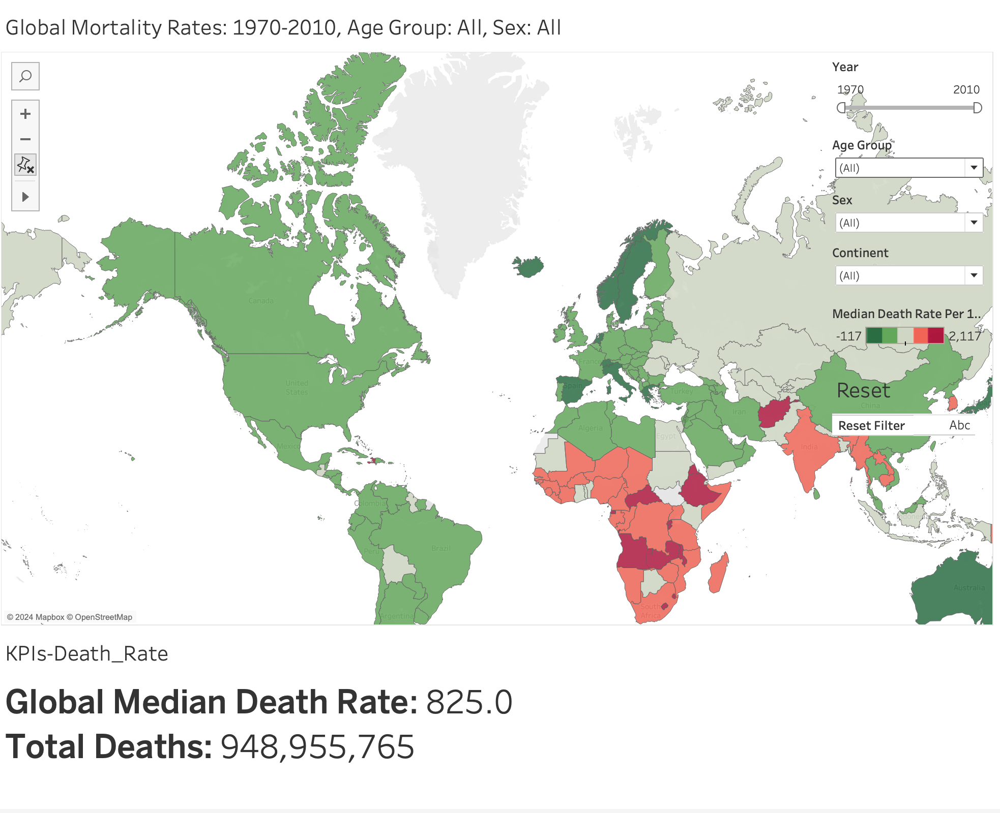
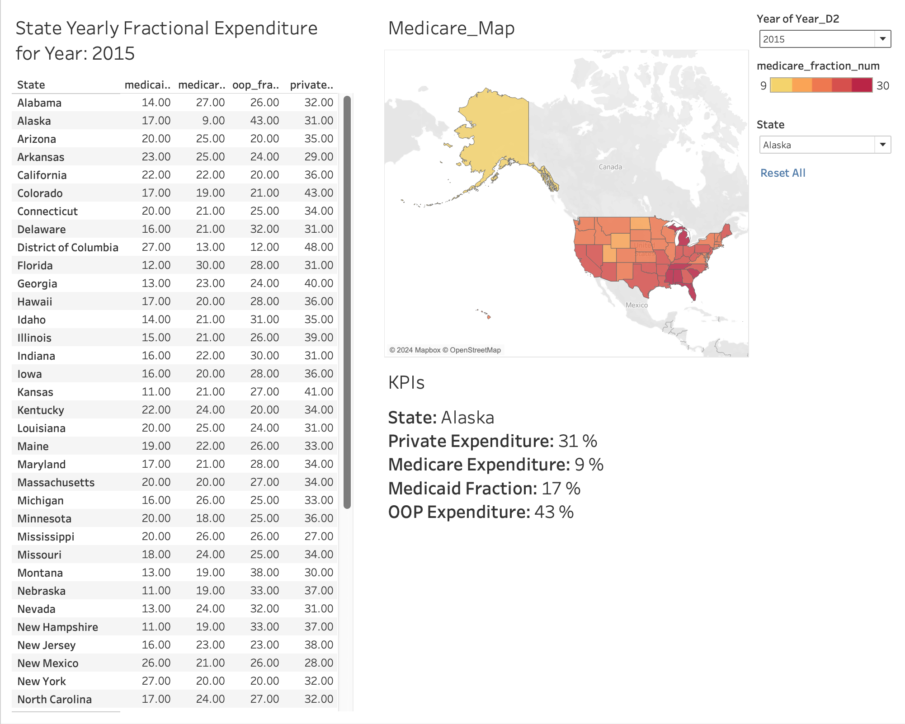

<div align="center">

# Tableau Dashboards Showcase

**Interactive public-health dashboards built on IHME data, with a reproducible audit of every published number.**

[](https://public.tableau.com/app/profile/satvik.praveen4534/vizzes)
[](./LICENSE)
[](./DATA_LICENSE.md)
[](./pyproject.toml)
[](./CITATION.cff)

</div>

---

## Overview

This repository holds two Tableau projects that explore global mortality and US
health spending using estimates from the Institute for Health Metrics and
Evaluation (IHME). Each project ships the raw data, the Tableau workbooks,
dashboard screenshots and documentation of its method and limitations.

A dependency-free Python toolkit checks the data and the dashboards against each
other. It verifies the raw files byte-for-byte and reproduces every headline
number in the screenshots from source. It also documents where an aggregation
choice changes the result.

| | Project | Data | Coverage | Dashboards |
|---|---|---|---|---|
| 01 | [**Global Mortality, 1970-2010**](./01_Global_Mortality_Analysis/README.md) | GBD 2010 Mortality Results | 187 countries, 5 decennial years, 20 age groups, by sex | 2 |
| 02 | [**Cost of Care: US State Health Spending**](./02_Cost_of_Care_US_State_Healthcare_Spending_Analysis/README.md) | IHME US Health Expenditure by State, Payer, and Type of Care | 50 states + DC, 2015-2019 | 3 |

<table>
  <tr>
    <td width="50%"><a href="./01_Global_Mortality_Analysis/README.md"></a></td>
    <td width="50%"><a href="./02_Cost_of_Care_US_State_Healthcare_Spending_Analysis/README.md"></a></td>
  </tr>
  <tr>
    <td align="center"><sub>Global mortality: median death rate by country</sub></td>
    <td align="center"><sub>US spending: payer shares by state</sub></td>
  </tr>
</table>

## Audit findings

The [analytical audit](./docs/analytical_audit.md) recomputes each published value
from the raw data. Every value is reproduced exactly, and each finding names a fix.
The main results:

- **Mortality counts are four times too high under the default filters.** The data
  store `Both` and `All ages` totals next to their components, and the filters
  default to *(All)*. The dashboard shows 210,567,809 deaths in 2010, while IHME's
  estimate is 52,641,951.
- **Some charts add rates or per-capita values together.** Summed death rates reach
  millions per 100,000. Spending per person is summed across years or states when
  the year filter is *(All)*.
- **Spending shares are correct for a single year.** The published payer and
  service-type views match the source exactly.
- **Uncertainty is discarded.** Most state-level payer growth-rate intervals include
  zero, so ranking states on them is not supported.

The workbooks are left unchanged so they keep matching the public vizzes. The
project READMEs list corrected figures next to the published ones.

## Quick start

**View the dashboards.** Open them on
[Tableau Public](https://public.tableau.com/app/profile/satvik.praveen4534/vizzes).
No installation is needed.

**Open the workbooks.** Use Tableau Desktop 2024.3 or newer. Each workbook stores
the author's original file path, so reconnect it to the file in the project's
`Dataset/` folder when prompted.

**Reproduce the analysis.** You need Python 3.9 or newer. No packages are required.

```bash
git clone https://github.com/SatvikPraveen/Tableau-Dashboards-Showcase.git
cd Tableau-Dashboards-Showcase
make check    # verify data, run the tests, confirm generated docs are current
make audit    # print the analytical audit
```

| Command | Purpose |
|---|---|
| `python -m tools.verify_data` | Checksums, schema, coverage and aggregate identities of the raw data |
| `python -m tools.audit` | Reproduce published numbers and compute corrected values |
| `python -m tools.inspect_workbooks` | Inventory of connections, sheets and calculated fields |
| `python -m unittest discover -s tests -t .` | Unit and regression tests |

## Repository structure

```text
Tableau-Dashboards-Showcase/
├── 01_Global_Mortality_Analysis/
│   ├── Dataset/                  # IHME GBD 2010 mortality CSV (raw, unmodified)
│   ├── Images/                   # Dashboard screenshots
│   ├── Global_Mortality_Analysis.twb          # Main workbook (both dashboards)
│   ├── Global-Mortality-Rate-Dashboard.twb    # Standalone dashboard export
│   ├── Time-Series-Dashboard.twb              # Standalone dashboard export
│   └── README.md
├── 02_Cost_of_Care_US_State_Healthcare_Spending_Analysis/
│   ├── Dataset/                  # IHME state health spending data tables (raw)
│   ├── Images/
│   ├── Statewise_Healthcare_Spending_Analysis.twb   # Main workbook (3 dashboards)
│   ├── *_Dashboard{1,2,3}.twb                       # Standalone dashboard exports
│   └── README.md
├── tools/                        # Python audit toolkit (standard library only)
├── tests/                        # Unit and regression tests
├── docs/
│   ├── analytical_audit.md       # Generated: findings with reproduced numbers
│   └── workbook_inventory.md     # Generated: workbook structure and formulas
├── data/CHECKSUMS.sha256         # SHA-256 manifest of data and workbooks
├── ci/github-actions.yml         # CI workflow (move to .github/workflows/ to enable)
├── CITATION.cff · DATA_LICENSE.md · CONTRIBUTING.md · CHANGELOG.md
├── Makefile · pyproject.toml
└── LICENSE
```

## Methods in brief

- **Visualization.** Tableau Desktop 2024.3 with choropleths, treemaps, packed
  bubbles, line charts, KPI tiles and cross-filtering through dashboard actions.
- **Data preparation.** Done in Tableau calculated fields. Examples include a
  continent lookup, decade-on-decade change, and parsing IHME's
  `point (lower - upper)` text cells into numbers.
- **Verification.** Raw data are pinned by SHA-256. Structural invariants are
  tested: `Both` equals Male plus Female, and `All ages` equals the sum of the age
  bands. Every number cited in the documentation is produced by code and covered
  by a regression test.

## Data and licensing

The code, workbooks and documentation are released under the [MIT License](./LICENSE).
The datasets belong to IHME and are governed by the
[IHME Free-of-Charge Non-Commercial User Agreement](https://www.healthdata.org/data-tools-practices/data-practices/ihme-free-charge-non-commercial-user-agreement).
They may not be used commercially. See [DATA_LICENSE.md](./DATA_LICENSE.md) for
citations and redistribution terms.

## Citation

If you use this work, please cite it with the metadata in [CITATION.cff](./CITATION.cff).
GitHub shows this under **Cite this repository**. Please also cite the underlying
datasets:

- Global Burden of Disease Collaborative Network. *Global Burden of Disease Study 2010
  (GBD 2010) Mortality Results 1970-2010.* Seattle: IHME, 2012.
- Institute for Health Metrics and Evaluation. *United States Health Expenditure by
  State, Payer, and Type of Care, 2003-2019.* Seattle: IHME, 2022.

## Contributing

Corrections and new projects are welcome. Please read [CONTRIBUTING.md](./CONTRIBUTING.md).
It explains how to keep the analysis reproducible: raw data stays immutable, and
every documented number is computed and tested.

## Author

**Satvik Praveen** · [GitHub](https://github.com/SatvikPraveen) ·
[Tableau Public](https://public.tableau.com/app/profile/satvik.praveen4534/vizzes)
